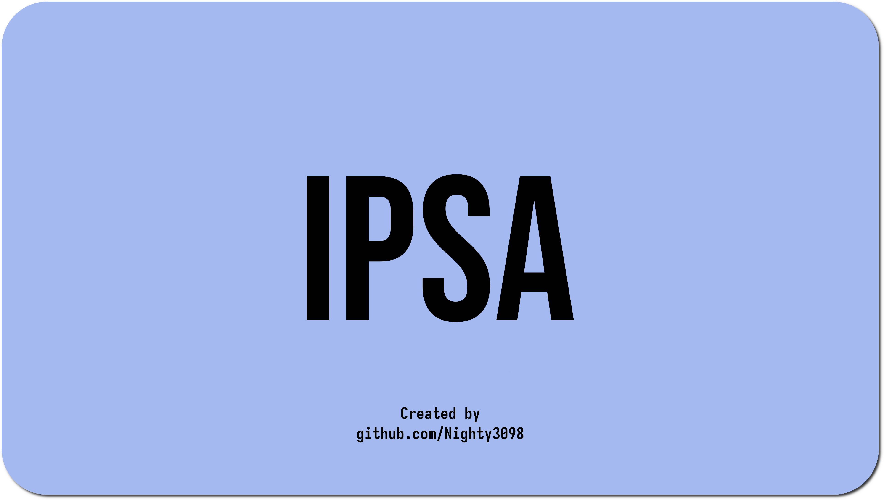

<div align="center">
    <h1>🌊 IPSA</h1>
    <br>
    
    <br><br>
    
    
    <br><br>
    <a href="https://t.me/DXS_TechSupport_bot"></a>
    <a href="https://discord.gg/tnHSEc2cZv"></a>
</div>

<br><br><br>

#### Install Poetry:


```
curl -sSL https://install.python-poetry.org | python3 -
```

#### Installing


```
git clone https://github.com/Nighty3098/InvestingAssistant
cd InvestingAssistant
poetry shell
poetry install
cd src
```

#### In .env file


```
API_ID = ''
API_HASH = ''
BOT_TOKEN = ""
```

#### Run


```
python3 main.py
```

<div align="center">
<br><br>
<h1>ROADMAP</h1>

<br>
</div>

<div align="center">
<details>
<summary><h3>Screenshots</h3></summary>


<br/>


</details>
</div>
