```mermaid
graph TD;
    A[Этап 1. Исследование и планирование] --> B[Анализ основных требований к проекту]
    A --> C[Исследования технологий]
    A --> D[Составление технического задания]

    E[Этап 2. Дизайн и архитектура] --> F[Проектирование архитектуры проекта]
    E --> G[Составление прототипа интерфейсов]
    E --> H[Создание структуры базы данных]

    I[Этап 3. Создание базового функционала] --> J[Составление диалогов с пользователем]
    I --> K[Подключение базы данных]
    I --> L[Работа с API и парсингом данных]

    M[Этап 4. Разработка нейронной сети] --> N[Сбор и подготовка данных для обучения]
    M --> O[Обучение и тестирование модели]
    M --> P[Интеграция модели в бота]

    Q[Этап 5. Запуск и развертывание] --> R[Создание Docker контейнеров]
    Q --> S[Развертывание проекта на сервере]
    Q --> T[Маркетинг и пиар]
    Q --> U[Введение платной подписки]
```

<div align="center">
    <h1>🌊 IPSA</h1>
    <br>
    
    <br>
</div>

<p align="center">
  <a href="https://github.com/Nighty3098/InvestingAssistant/stargazers">
    <br><br>
    <a href="https://discord.gg/6xEc5WFK"></img></a>
    <br><br>
    
    
    
    
    <br><br>
    <a href="https://t.me/Night3098" target="blank"></a>
    <a href="https://discord.gg/#9707" target="blank"></a>
    <a href="https://www.reddit.com/user/DEVELOPER0x31/" target="blank"></a>
</p>

<br><br><br>

#### Install Poetry:


```
curl -sSL https://install.python-poetry.org | python3 -
```

#### Installing


```
git clone https://github.com/Nighty3098/InvestingAssistant
cd InvestingAssistant
poetry shell
poetry install
cd src
```

#### In .env file


```
API_ID = ''
API_HASH = ''
BOT_TOKEN = ""
```

#### Run


```
python3 main.py
```

<div align="center">
<br><br>
<h1>ROADMAP</h1>
    
<br>
<br>

### **`💵 Support me`**


<br>

***`UQCF-sPDO0QqkNtvy5CKSvYWEsZS6l7vzaytV36oYM0SNhKt`***

<br>
<details>
<summary>Screenshots</summary>


<br/>


</details>
</div>


